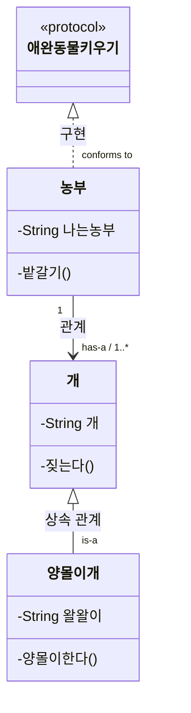

# :mortar_board: 클래스 다이어그램

> 디자인 패턴을 학습할때에 이해를 돕기 위해서 사용되는 클래스 다이어그램을 알아보자.

## 클래스 다이어그램이란?

클래스 다이어그램은 클래스, 프로토콜, 프로퍼티, 메서드 및 클래스 다이어그램 간 관계 내용이 포함된다.
> 한눈에 그림으로 내용을 파악 할 수있어 디자인 패턴 학습에 도움이 매우매우 될 것 같다. :thumbsup:

* mermaid를 이용한 클래스 다이어그램 작성

개와 양몰이개는 상속 관계로 양몰이개는 개이고, 개는 양몰이개가 아니다
농부는 양몰이개를 한마리 이상 가지고 있다.

** 클래스 다이어그램 관계(mermaid)
